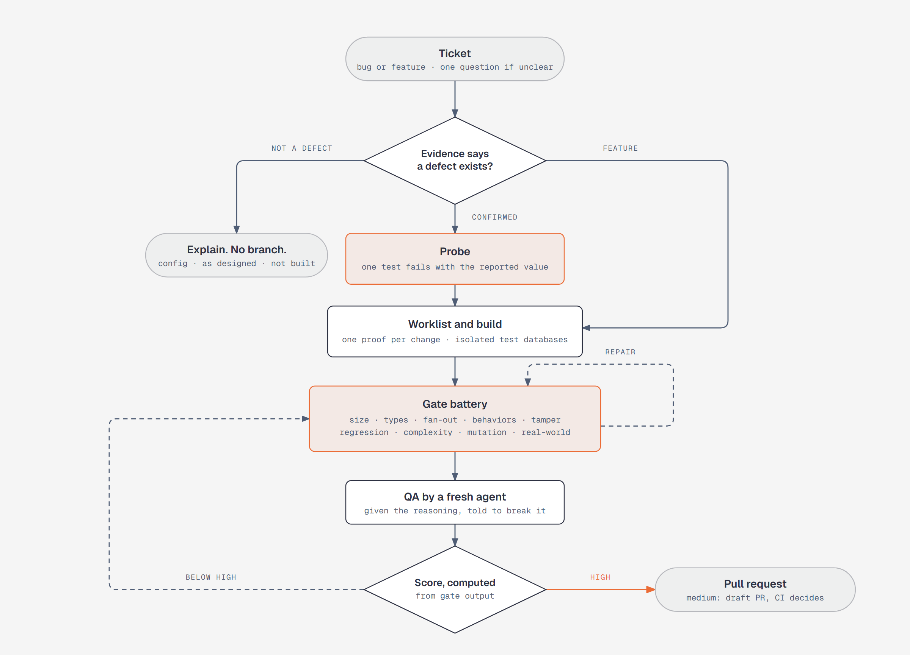

# falsify

A Claude Code plugin that takes a ticket to a pull request and refuses to skip the proof at any step.
No branch until evidence shows the defect exists. No fix until one test fails with the value the
reporter saw. No pull request until every gate has passed and a score computed from the gate output
reads high.



## Install

```
/plugin marketplace add maxymlyskov/falsify
/plugin install falsify@falsify
```

Then, once per repository:

```
/falsify:setup
```

Setup asks where tickets live (GitHub Issues, Linear, Jira, local files), what the test command is and
how it reports a pass, which branch is the base, whether there is a UI it can screenshot, and where the
handoff goes. It runs each answer before accepting it and writes `.claude/falsify.config.json`.

## A run

`/falsify:task 212` fetches the ticket and checks out the base branch. For a bug it gathers read-only
evidence and reaches a verdict. The default hypothesis is that the system works as configured; a root
cause written in the ticket is a hypothesis to disprove. A verdict of configuration, as designed, or not
built ends the run with an explanation and no branch.

A confirmed defect gets a probe: one test in the spec that owns the code, asserting the value the
reporter expected. It has to fail, and the actual value has to equal the reported one. That equality is
the proof. Only then does a branch exist.

The worklist lists one change per item with the test that proves it. Coders receive their slice and
nothing else, and each runs on its own test database. The gate battery then runs; a failing gate starts a
repair round. A QA agent that did not write the code receives the reasoning
behind each design decision and tries to falsify it. The score is computed from the gates' output. High
opens a pull request. Medium opens a draft and waits for CI. Anything lower returns to the battery.

The full procedure is [`skills/task/SKILL.md`](skills/task/SKILL.md). The checklist any harness can
implement is [`contract.md`](skills/task/references/contract.md).

## What a run leaves behind

```
## Confidence
Diagnosis     CONFIRMED-BUG — probe deposit.spec.ts "charges $50 for a 2-lane package" expected 50 got 0 [A]
Behaviors     1 RED→GREEN                                                                    [A]
Regression    select-specs: 2 specs, 489 passing, 0 failing                                  [A]
Fan-out       1 flagged (deposit.mapper.ts, conf 0.8) — edited in round 2                    [A]
Complexity    worst calculateDeposit cyclomatic 7 / 10 · cognitive 9 / 15                    [A]
Mutation      killed 3 of 3 tried (candidates 3) · survivors 0 · equivalent 0                [A]
Real-world    G4 whole owning spec ran                                                       [A]
Cleanliness   0 fixes                                                                        [A]
QA            5/5 procedure steps [A] · 3 edge cases · 6 house checks (0 fired) · blocking 0 [A]
Size          14 LOC · Tamper clean · Types base 0 → branch 0
Score 100 / 100 · Verdict HIGH · rounds 2 · wall 9m41s · weights: prior — unmeasured
```

`scorecard` prints this block from the gates' JSON results; the model cannot edit it. `[A]` marks a
measurement this run executed, `[B]` one it inherited or proxied. Two `[B]` rows on important dimensions
bring the verdict down to medium. The block above comes from the scorecard's test fixture; the first
recorded run on a public repository replaces it.

## The gates

Each gate detects one class of defect, has a source that shows the class is real, and cannot pass while
the property is false. Each is a Node script in [`bin/`](bin/README.md) with no runtime dependencies and
a test that failed before the gate was fixed.

| Gate | Catches | Source | Rule |
|---|---|---|---|
| Size | review blindness on large diffs | Rigby and Bird, 2013: median change 25 to 78 lines. SmartBear, 2006, practitioner data: never over 400 | over 400 changed lines halts; opt out with a written reason |
| Types | type errors, including in files the diff did not touch | Gao, Bird and Barr, ICSE 2017: 15% of public JS bugs detectable by TypeScript | branch error set is a subset of the base error set |
| Fan-out | the file you forgot | Zimmermann et al., ICSE 2004: co-change mining places a correct site in the top three over 70% of the time | a file that co-changed with a changed file in half its history and is missing from the diff is edited or dismissed with a reason |
| Behaviors | the fix does not do what the ticket says | Fucci et al., TSE 2017: small, uniform TDD cycles predict quality; test-first order alone does not | one test per behavior, red then green, zero failures |
| Tamper | tests weakened to pass | ImpossibleBench, 2025: GPT-5 passes 76% of spec-contradicting tests by editing them. Zhang and Mesbah, 2015: assertions predict effectiveness | a removed test, an added skip, or a removed assertion fails the run |
| Regression | broken existing behavior | Rothermel and Harrold, 1997; Ekstazi, ISSTA 2015 | every spec whose imports reach a changed file runs whole |
| Complexity | code the next reader cannot hold | McCabe 1976 and NIST 500-235: 10. SonarQube default: 15 cognitive | cyclomatic over 10 or cognitive over 15 on a new or grown function |
| Mutation | tests that run the code and assert nothing | Just et al., FSE 2014: mutants track real faults; coverage does not (Inozemtseva and Holmes, 2014). Google, ICSE 2018 and 2021 | one mutant per added line; each survivor is killed or marked equivalent with a reason |
| Real-world | it works in the test and fails in the app | Zeller, Why Programs Fail: reproduce first. Ambler and Sadalage, 2006: expand then contract | a screenshot, a rolled-back migration proof, or the deepest test run |

Every threshold states its provenance in [`gates.md`](skills/task/references/gates.md), and the ones that
are tool defaults say so. Full citations with DOIs are in [`why.md`](skills/task/references/why.md).

## Why the score is computed

A number means something only when you can say what it measures and how you know (Kaner and Bond, 2004).
This score measures one thing: how much of the claimed confidence was executed in this run. The hard
gates (types, behaviors, tamper, regression, real-world, size, QA) are conjunctive; one failure makes the
score 0, because defects do not average. The weights are declared priors, marked unmeasured in the config,
to be fitted once outcomes are tracked. The score says nothing about correctness, and the README says so
because a reader who checks that claim would be right to distrust the rest.

Language models grade their own output favourably (Panickssery, Bowman and Feng, NeurIPS 2024) and show
position and verbosity bias (Zheng et al., NeurIPS 2023). That is why the verdict is a script and the QA
reviewer is a fresh agent.

## What can fool a gate

A review of the previous version of this pipeline found three of eight gates passing while wrong: the
regression gate keyed on spec edits, the mutation gate counted crashes as kills, the type gate ignored
errors in unchanged files. [docs/what-can-fool-a-gate.md](docs/what-can-fool-a-gate.md) lists each
finding and what closed it. The [incident ledger](skills/task/references/incidents.md) records every rule
in the pipeline, the incident that produced it, and the check that now catches it.

## Not built

[`docs/out-of-scope/`](docs/out-of-scope/) explains why there is no coverage gate and no LLM quality
score, and what outcome tracking (does a high verdict predict fewer reverts?) would take.

## Repository

[`docs/thesis.md`](docs/thesis.md) is the argument in full. [`docs/adr/`](docs/adr/) holds the decisions
a reader will question, each with its evidence. [`docs/open-questions.md`](docs/open-questions.md) lists
what is not measured yet. [`STYLE.md`](STYLE.md) governs every skill file and
[`CONTRIBUTING.md`](CONTRIBUTING.md) the commits, which follow the Angular convention so that
`git log --oneline -- bin/mutants` reads as that gate's history.

MIT.
